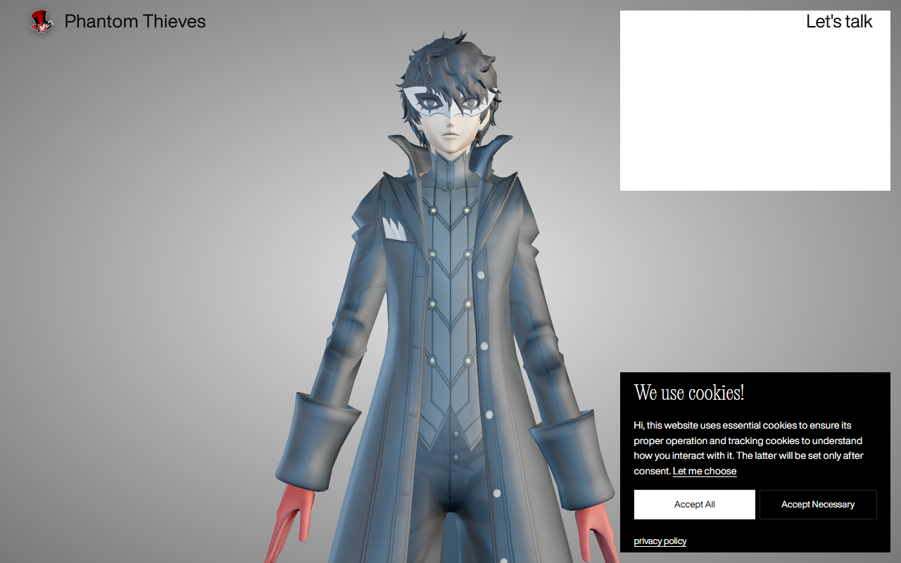

# Phantom Thieves of Hearts — Persona 5 Royal (L.I.S.A Interactive Experience)

Duplikat interaktif dari website **[https://lisa.locomotive.ca/en](https://lisa.locomotive.ca/en)** yang telah direbrand total menjadi **Phantom Thieves of Hearts** dengan avatar 3D interaktif **Joker dari Persona 5 Royal**, lengkap dengan logo resmi Flaming Top Hat & Domino Mask!



Proyek ini telah direkonstruksi dan dimodifikasi agar dapat dijalankan secara lokal dengan seluruh fitur interaktif, grafis 3D WebGL (Three.js), tipografi dinamis, efek suara, preloader bertema Persona 5 Royal, dan model karakter 3D kustom Joker (Phantom Thief attire) yang responsif terhadap pergerakan mouse dan dialog interaktif.

---

## Fitur & Modifikasi Utama

1. **Rebranding Phantom Thieves & Logo Persona 5 Royal**:
   - Branding "Locomotive" diganti sepenuhnya menjadi **Phantom Thieves**.
   - Logo header diganti menggunakan vektor resmi logo **Phantom Thieves of Hearts (Flaming Top Hat dengan Domino Mask)** khas Persona 5 Royal.
   - Preloader bertema Metaverse dengan logo berapi Phantom Thieves, efek red aura glow, dan tipografi dinamis.
   - Metadata, OpenGraph, dan favicons (`favicon-16x16.png`, `favicon-32x32.png`, `apple-touch-icon.png`) diperbarui dengan emblem Persona 5 Royal.

2. **Karakter 3D Kustom — Joker (Persona 5)**:
   - Model 3D game-accurate Joker (`assets/lisa/sixty/lisa.glb`) lengkap dengan jubah hitam khas Phantom Thief, kerah tinggi, rompi double-breasted, topeng domino putih (mask), rambut acak anime, dan sarung tangan merah.
   - Pose berdiri santai (relaxed standing pose) yang natural dengan lengan rileks di samping badan.
   - PBR Materials (Standard/Physical) dengan tekstur beresolusi tinggi, pencahayaan refleksi dinamis EXR, dan dukungan double-sided rendering.
   - Rigging hierarki Three.js adaptif (`Lisa`, `Armature`, `neck1`, `torso`, `Head`, `Raycaster`) yang mempertahankan animasi pernapasan (idle sway) serta mouse-look tracking.
3. **Voice Audio & Sound Effects (Web Audio API)**:
   - Backsound ambien `ambient.mp3` dengan loop dan kontrol volume.
   - **319 file suara studio asli** dalam format `.mp3` (`assets/lisa/en/*.mp3`) untuk seluruh variasi dialog percakapan.
   - Visualizer audio interaktif yang merespons frekuensi suara.
4. **Interactive Dialog Tree (100 Langkah)**:
   - Pohon keputusan lengkap tersimpan di `lisa_data.json` dan `index.html`.
   - Flow *"Start a project"* (nama, perusahaan, role, tipe proyek, budget range, deadline, brief upload).
   - Flow *"Join the team"* (lowongan pekerjaan, freelance creative/technical, gif hover preview).
   - Flow *"Drop a quick word"* & *"Discover our culture"*.
5. **Tipografi & Desain Asli**:
   - Webfont resmi: `HelveticaNowDisplay-Regular` dan `PPLocomotiveNew-Light` (.woff2 & .woff).
   - CSS styles asli Locomotive (`main.css`), SVG sprite icons (`sprite.svg`), favicons, dan styling responsif.

---

## Cara Menjalankan

### Cara 1: Menggunakan Python (Direkomendasikan)
Buka terminal di folder ini dan jalankan:
```bash
python server.py --open
```
Server akan berjalan di `http://localhost:3000` dan browser default Anda akan otomatis terbuka.

### Cara 2: Menggunakan NPM
```bash
npm start
```

### Cara 3: Menggunakan Static Server Apa Saja
Anda juga dapat menggunakan server statis lainnya seperti `npx serve`:
```bash
npx serve -p 3000 .
```

---

## Struktur Direktori

```
lisa-locomotive-clone/
│
├── index.html                  # Halaman utama dengan template Vue, Modular config & data dialog
├── lisa_data.json              # Data JSON lengkap seluruh state tree dialog LISA
├── server.py                   # Local server Python dengan MIME types & CORS lengkap
├── package.json                # Script runner untuk npm start
├── README.md                   # Dokumentasi proyek
│
├── assets/
│   ├── 3d/                     # Model 3D cincin, tekstur studio & arkit
│   │   ├── ring.compressed.glb
│   │   ├── studio_blur_small.jpg
│   │   └── arkit.png
│   │
│   ├── fonts/                  # Font resmi Helvetica Now & PP Locomotive New
│   │   ├── HelveticaNowDisplay-Regular.woff2
│   │   ├── HelveticaNowDisplay-Regular.woff
│   │   ├── PPLocomotiveNew-Light.woff2
│   │   └── PPLocomotiveNew-Light.woff
│   │
│   ├── images/                 # Favicons, SVG sprite, dan GIF assets
│   │   ├── sprite.svg
│   │   ├── favicons/
│   │   └── gifs/
│   │
│   ├── lisa/
│   │   ├── fx/
│   │   │   └── ambient.mp3     # Musik latar ambien
│   │   ├── en/                 # 319 file suara voice clip dialog LISA
│   │   │   ├── lisa.intro.1.mp3
│   │   │   ├── lisa.greeting.1.mp3
│   │   │   └── ...
│   │   └── sixty/              # Model 3D avatar LISA & video screen texture
│   │       ├── lisa.glb
│   │       ├── envmap.exr
│   │       ├── running_code.mp4
│   │       ├── idea.mp4
│   │       ├── face1.jpg
│   │       └── face2.jpg
│   │
│   ├── scripts/                # Bundle JavaScript modular Locomotive
│   │   ├── vendors.js
│   │   └── app.js (GSAP, Three.js, Vue 3, HLS.js, Web Audio)
│   │
│   └── styles/
│       └── main.css            # Stylesheet utama Locomotive
│
└── uploads/                    # Job preview GIF & OpenGraph metadata
    ├── job-positions/
    └── metadata/
```

---

## Teknologi & Arsitektur
- **Locomotive Modular JS**: Arsitektur modular berbasis atribut HTML (`data-module-*`).
- **Three.js**: Rendering 3D WebGL untuk karakter avatar LISA dan material PBR shader.
- **GSAP (GreenSock)**: Animasi teks preloader dan transisi state dialog.
- **Vue 3**: Reactive data-binding untuk form, pilihan menu, dan state management percakapan.
- **Web Audio API**: Pemutaran audio suara asisten dan audio reactive visualizer.
